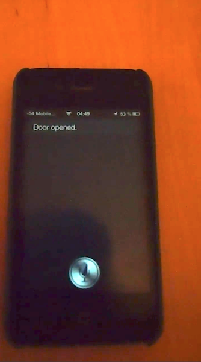

Siri Door Opener – A hack to enable iPhone Siri to open an apartment door remotely
====================

This is a small personal project from 2013.

Siri Door Opener is a plugin to Siriproxy to enable iPhone Siri to open apartment doors with commands like "Please, open the door" (see demo). It was part of a bigger Raspberry Pi-project to hack my friend's apartment door system to enable remote unlocking.

Setting up the hack to enable Siri to follow custom commands is not the easiest thing in the world. First, you need to set up Siriproxy as a gateway between your iPhone and Apple's servers. To be able to hijack the connection, you need to install a DNS server, set up your router or phone to use this custom DNS server and forward Siri's server domain name to Siriproxy instead. Siri will only accept the new server if it is trusted, so you also need to create a self-signed certificate which says that the Siriproxy-server is Apples servers. Finally, you need to install the root certificate you signed the certificate with, onto your iPhone. After all that you should be able to use Siri just as normally with your custom commands.

### Demo

<video width="320" height="240" controls>
  <source src="example_video.mp4" type="video/mp4">
</video>

### Installation

Build and install the bundle

	gem build siriproxy-dooropener.gemspec
	
	gem install siriproxy-dooropener-0.0.1.gem

Add sirirproxy-dooropener to Siriproxys config file (Eg. ~/.siriproxy/config.yml)
The name of the directory must be `siriproxy-dooropener`. The path should be the path to the parent directory of `siriproxy-dooropener`. `siriproxy-dooropener` should not be included in the path!
	
	plugins:
	- name: 'dooropener'
	  path: '/path/to/plugins/'

Reload SiriProxy
	
	siriproxy bundle

Run SiriProxy

	siriproxy server

Questions?
----------

Feel free to [send me an email](http://www.jontingvold.no/) if you have questions about the project.

License
-------

[MIT](LICENSE)